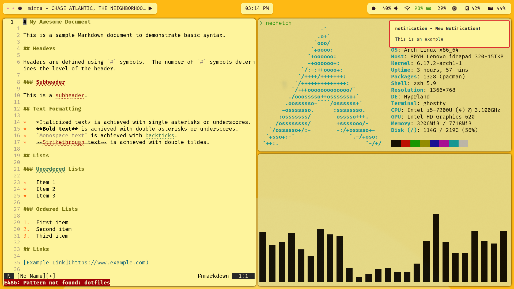

# Dotfiles

*My Arch environment configuration files.*

> **Warning:**  
> This setup is customized for my workflow.  
> Do not use unless you know what you’re doing.  
> Feel free to fork this repo if you want to adapt it — I push updates that may break existing configs.

## Installation

See [INSTALL.md](./INSTALL.md) for setup instructions.

## Themes

<details open>
  <summary><strong>Available Themes</strong></summary>

  ### Light
  <p align="center">
    
    
  </p>

  ### Retro
  <p align="center">
    
    
  </p>

  ### Solarized
  <p align="center">
    
    
  </p>

</details>

## After Setup

Keep your environment updated and synced using the commands below.

### System Updates

```bash

    # Update system packages
    update-pacman

    # Full system upgrade (-Syu)
    update-pacman -Syu

    # Update AUR packages
    update-yay

    # Full AUR upgrade (-Suy)
    update-yay -Suy

    # Sync and replace configuration files
    RUN_SCRIPT=true config-sync
```

* Useful Links

* [Arch System Maintenance](https://wiki.archlinux.org/title/System_maintenance)
* [Nerd Font Icons](https://www.nerdfonts.com/cheat-sheet)
